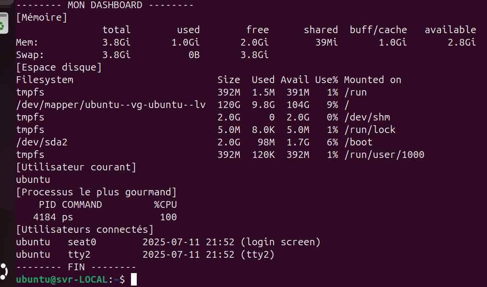
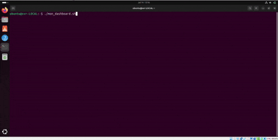

## Dashboard Linux

**Description synthétique :**
Ce projet propose un tableau de bord interactif pour surveiller et visualiser l’état d’un système Linux (CPU, RAM, stockage, processus, etc.) via une interface graphique simple.

**Image (paysage) :**

**GIF démonstration (<5 s) :**

**Vidéo courte sans son (<1 min) :**
[Voir la vidéo](visuel_dash.png) <!-- Remplacer par le lien ou intégrer la vidéo si disponible -->

**Lien GitHub :**
[À renseigner](https://github.com/username/dashboard-linux)

**Technologies utilisées :**
- Bash (script `mon_dashboard.sh`)
- Linux (monitoring système)
- Visualisation graphique (images, GIF)
